<div align="center">

# open-ats

**An AI recruiting system, rebuilt by hand and opened up.**
*Run your application through the machine, before a real one runs it.*

[](LICENSE)
[](https://nodejs.org)
[](#your-data-never-leaves-your-machine)
[](#engines)

🇫🇷 [Lire en français](README.md)


</div>

> **Note** : the interface is in French, because I built it for myself first.
> The prompts, the code and this documentation are in English. Translating the UI
> is [a good first issue](https://github.com/spykernv/open-ats/issues) if you fancy it.

---

## Why this exists

Everyone reaches a point where they have to tell the story of their career. A new graduate starting out, a professional realigning their path, or simply someone looking for the words today's market actually uses: the task is the same every time. Compress years of work into a single page, and make that page say at a glance who you are and where your value lies.

It is hard, and it is judged fast. Your CV is read first by software that parses it, scores it and ranks it. Then by a person, in about twenty seconds. That is not unfair: a recruiter facing 800 applications needs to sort them. But it is opaque. You never see the criteria, only the outcome. And it matters even when the door is already ajar: a referral gets you into the room, it does not yet say what you are worth once you are in.

So I rebuilt the black box in the open, from what is publicly known about how ATS and AI screening tools work: posting parsing, requirement matrices, multi-filter scoring, the twenty-second review, benchmarking against the likely applicant pool. Then I put myself through it.

**Think of it as a tailor.** A good tailor does not disguise you: they take your measurements, cut into the cloth you already have, and bring out your best. Then they tell you how to adjust the cut for where you want to go, and they tell you honestly when a piece does not suit you. That is what open-ats does with your career: it measures, it adjusts, and it shows you what genuinely fits you and what does not.

For me, the first thing it surfaced was a vocabulary gap, not a skills gap. I was writing "automated weekly reporting" where the role was looking for "data analysis". Same work, different words, signal lost. Having a system say so plainly, requirement by requirement, evidence by evidence, changed how I present myself.

Since then it has opened doors I did not expect and introduced me to remarkable people. I am publishing it because I have no reason to keep it to myself: it is yours.

---

## What it does

You drop in three things: **the job posting** (screenshots, PDF or plain text), **your CV**, and **your cover letter** if you have one. Sixteen stages then run: fourteen are handed to an agent, a fifteenth compares your versions from v2 onwards, and the final report is assembled in code. Together they:

1. **Understand the role**: reconstruct the posting and extract a requirement matrix (`MUST_HAVE`, `STRONG_SIGNAL`, `NICE_TO_HAVE`, context, culture), separating what is stated explicitly from what is merely inferred.
2. **Understand the company**: web research, with every finding tagged `FACT`, `STRONG_INFERENCE` or `WEAK_INFERENCE` and sourced. Then model *why this role exists* and what the realistic ideal candidate looks like.
3. **Score you**: out of 100, broken down into the four filters that match the four moments an application dies: the **automated screen (ATS)**, the **recruiter screen**, the **hiring manager**, and **strategic fit**.
4. **Attack you**: an adversarial agent looks for reasons to reject you in twenty seconds; another benchmarks you against the likely applicant pool.
5. **Rewrite**: an improvement plan ranked by return on effort, then a rewritten CV and cover letter.
6. **Verify**, and this is the heart of it: a quality controller re-reads every rewritten sentence and **blocks anything your original CV doesn't prove.**

You fix things, upload a v2, and the system compares: what improved, what regressed, what still blocks. Until it tells you either *this is ready*, or, just as usefully, *the document has hit its ceiling, the remaining gap is a real experience gap, stop rewriting and change channel.*

---

## The rule that matters

> **The system is not allowed to invent.**

Before any rewriting, an agent extracts an **Evidence Bank** from your CV: the list of what you can actually prove. Every sentence produced afterwards must point back to one of those pieces of evidence. The quality controller blocks the rest, and when it can't phrase something without knowing, it leaves an explicit marker:

```
[TO COMPLETE: which language this project used, I cannot infer it from the CV]
```

This is deliberately frustrating. It is also the only setting that makes the tool useful: an optimised application that collapses at the first interview question has wasted your time and the recruiter's.

**This is not a keyword stuffer.** It refuses to insert the vocabulary of a domain you haven't worked in, even when doing so would mechanically raise the score. It exists to help you **say what is true, better**, not to say something else.

---

## Getting started

```bash
git clone https://github.com/spykernv/open-ats.git
cd open-ats
npm install
```

### See what it looks like, in 2 minutes, consuming nothing

`mock` mode fills the pipeline with canned data: ideal for touring the interface before deciding whether the project is for you.

```bash
# macOS, Linux
LLM_PROVIDER=mock MOCK_DELAY_MS=1200 npm start
```

```powershell
# Windows PowerShell
$env:LLM_PROVIDER="mock"; $env:MOCK_DELAY_MS="1200"; npm start
```

Then, in a second terminal:

```bash
npm run demo
```

A complete fictional application is created and analysed end to end. Open **http://localhost:3777**.

### For real

**No API key needed.** By default the engine is **your own agent session**: the app drops each stage into a file queue, your agent picks it up, does the work itself (reading screenshots and PDFs, searching the web, writing, producing JSON), and answers.

```bash
npm start
```

Then, **inside your Claude Code session** (or any agent, see below):

```bash
npm run bridge
```

Open **http://localhost:3777**. The sidebar tells you live whether a session is listening, what it's working on, and what's queued. If the bridge disconnects, the pipeline **waits**, it doesn't fail. Restart `npm run bridge` and it resumes.

---

## Any agent can run it

**open-ats ships no model and trains none.** It orchestrates an agent you supply. The program itself reads files, waits, and checks what comes back.

The bridge isn't an integration. It's **a directory of files**.

```
bridge/queue/<jobId>/
├── job.json      ← stage metadata (title, files to read, web search expected?)
├── prompt.md     ← the full prompt
├── schema.json   ← the JSON Schema the answer must satisfy
└── result.json   ← what the agent writes  (that's it)
```

The server validates `result.json` against that stage's Zod schema. If it doesn't conform, it automatically republishes a repair job containing the exact error. No secrets travel through it, no sub-process is spawned: **any agent that can read and write files can be the engine.** `bridge/cli.mjs` (`wait` / `status` / `show` / `answer` / `fail`) is just a convenience on top.

---

## How it works

<p align="center">
  <picture>
    <source media="(prefers-color-scheme: dark)" srcset="docs/diagrams/pipeline-en-dark.svg">
    
  </picture>
</p>

<sub>Diagram source: [`docs/diagrams/pipeline.en.mmd`](docs/diagrams/pipeline.en.mmd) (mermaid). The SVGs are static so they render everywhere, including outside GitHub.</sub>

The final verdict (`APPLY NOW` / `IMPROVE FIRST` / `LOW PRIORITY` / `DO NOT APPLY`) is **computed in code**, not by the model: same input, same output, every time. Same for the Markdown report and the PDF exports: they're assembled from the JSON artifacts with no model call.

Shared stages (posting, company research, thesis, opportunity) are computed once per application and reused across versions.

---

## The interface

<table>
<tr>
<td width="50%"></td>
<td width="50%"></td>
</tr>
<tr>
<td><b>Summary</b>: seven scores, the verdict, the change since the previous version, and the twenty-second rejection risks.</td>
<td><b>Requirements &amp; Evidence</b>: every requirement in the posting against what your CV actually proves, with the crucial distinction between a <i>positioning gap</i> (fixable by rewriting) and an <i>actual experience gap</i> (not fixable).</td>
</tr>
<tr>
<td></td>
<td></td>
</tr>
<tr>
<td><b>Optimised CV</b>: the rewrite, a before/after for each bullet, and the integrity check that approved (or blocked) every sentence.</td>
<td><b>Dashboard</b>: every application ranked by score, with its verdict, version and submission status.</td>
</tr>
</table>

<details>
<summary><b>See the other screens</b> (new analysis, company research, console)</summary>
<br>

| | |
|---|---|
|  | **New analysis**: drop the posting, the CV, the letter. The letter is optional: without one, the system drafts it from your Evidence Bank. |
|  | **Company & Thesis**: the web research, each finding tagged by confidence level and sourced, then the recruiting model. |
|  | **Console**: a free-form question to your agent, with access to your analysis folders: "compare these two applications", "re-read this bullet". |

*(Screenshots taken in demo mode. The `[MOCK]` markers are the offline mode's canned data.)*

</details>

---

## Engines

The engine can be switched **live** from the interface, without restarting the server.

| Engine | What it is | API key |
|---|---|:---:|
| **`claude-session`** *(default)* | Your agent session runs each stage through the bridge. You see everything, you can step in. | no |
| `claude-cli` | Headless `claude -p` sub-process. Same subscription, unsupervised. Write tools disabled for safety. | no |
| `anthropic` | Direct Anthropic API: native structured outputs, streaming, adaptive thinking. | yes |
| `mock` | Canned data, to explore the interface or develop without consuming anything. | no |

Adding an engine means **adding one file** under `server/llm/`. Pipeline messages are engine-agnostic (`{type: "text" | "file"}`); each provider decides how to materialise the files.

---

## Your data never leaves your machine

This isn't negotiable, so it's wired into the project rather than promised in a doc:

- Everything lives in `applications/<id>/` on **your disk**. No third-party service, no database, no telemetry.
- `applications/`, `bridge/queue/`, `bridge/archive/` and `.env` are **git-ignored**. You can't commit your CV by accident.
- In `claude-session` mode the bridge only moves local files, no secret passes through it.
- PDF exports are rendered locally by `pdfkit`. No headless browser, no conversion service.

This repository contains no real application: the only dataset is fictional and generated by `npm run demo`.

---

## Deliberate choices

open-ats runs on your machine, for you. It is not a multi-user service, and that is not a missing step: it is what makes the guarantee above possible. Here is what follows from it, and what each decision costs.

- **JSON files rather than a database.** An application is a folder you can open, copy, version and delete by hand. The price is visible in the code: `server/storage/` writes to a temporary file then renames it, with retries, because the interface reads while the pipeline writes.
- **The interface polls every two seconds or so** rather than opening an SSE stream. On stages that take minutes the latency is invisible, and there is no connection state to manage.
- **JavaScript, with Zod at the boundaries.** The untrusted data here is not the code I write, it is what a model returns. Only runtime validation catches that, which is the job of the fifteen schemas, one per agent. Static typing would be a useful complement, not a replacement.
- **The verdict is tested case by case, the rest end to end.** `npm run test:unit` pins the verdict thresholds and the precedence between its rules; the E2E test in mock mode covers the whole pipeline while consuming nothing.
- **The prompts are calibrated for junior and VIE profiles** in business and data. Another profile or another market needs retuning, and it is all in plain sight under `server/prompts/`.

---

## Going further

- **[docs/ARCHITECTURE.md](docs/ARCHITECTURE.md)** : the map of the code, the 16 stages in detail, the HTTP API, and how to plug in your own engine or search provider.
- `server/prompts/*.md` : **the prompts are in plain sight, one file per agent.** That's where the real substance lives: read `_core_rules.md` first, it's the integrity contract every agent shares.

### Tests

```bash
npm run test:unit
```
Tests the deterministic verdict: thresholds, precedence between the rules, edge cases. Instant, no server, no dependency.

```bash
npm run test:bridge
```
Tests the bridge alone (job queue, schema validation, automatic repair). No server, no session required.

```bash
# macOS, Linux
LLM_PROVIDER=mock npm start
```

```powershell
# Windows PowerShell
$env:LLM_PROVIDER="mock"; npm start
```

Then, in another terminal, `npm test`. End to end: creation, 16-stage pipeline, report, v2 upload, re-evaluation, comparison. In mock mode it consumes nothing.

---

## Take it, break it, improve it

MIT licensed, so do what you like with it. A few directions if you're tempted:

- **Retune the prompts for your field.** They're calibrated for junior business and data profiles. A senior profile, an engineering role or a non-French market deserve different settings, it's all in `server/prompts/`.
- **Plug in your agent.** The bridge is just the filesystem: if your agent reads and writes files, it can be the engine.
- **Add a filter.** The four-filter model reflects my understanding of hiring. Yours may well be better.

Issues and PRs are welcome, and first-hand feedback even more so, especially if you've used it for real. If part of the code isn't clear, that's on me: open an issue and I'll fix it.

---

## If you want to turn it into a product

What is published here is a local tool, and it will stay that way. The two obvious extensions are not in this repository:

- **On the candidate side**, an online service where you drop in a CV without installing anything.
- **On the company side**, a decision-support tool for HR teams, applying the same evidence requirement to the applications they receive.

I have documented the product next steps and the business model for both, and an enterprise implementation roadmap is already under way with HR professionals who want to push it. The code is MIT licensed, so you need nobody's permission; but if this is something you seriously want to move forward, write to me on [LinkedIn](https://www.linkedin.com/in/jonathannaal/) rather than starting from scratch.

---

## A word on the exercise itself

Writing your CV and summarising your own career is undervalued work, sometimes rushed, squeezed into a Sunday evening between two applications. I have come to believe it is one of the most important things you can do for your career.

Taking the time for a real retrospective. Sitting down and looking at where your strengths actually were. Looking at what your CV says about you, then comparing it with what the people who have worked with you say about you: the gap between the two is often the most instructive part of the whole exercise. That is what lets you align better with what you want to do, explore where the market is moving, and reposition yourself.

For me it was an excellent complement to writing my thesis on an AI agent management system for steering a digital product. The two fed each other. And that is what stayed with the people I spoke to: not the document itself, but the clarity the exercise had given me about the market, about where I would bring the most value, and about what genuinely excites me intellectually.

That is what I hope you find in it. The optimised CV is only a by-product.

If the subject interests you, my thesis is currently under moderation on HAL and will be available here: <https://hal.science/view/index/docid/5735731>

---

<div align="center">

**Jonathan Naal**

For more about my background, or about working together, here is my [LinkedIn](https://www.linkedin.com/in/jonathannaal/).

<sub>MIT · Not affiliated with any ATS vendor or model provider.</sub>

</div>
