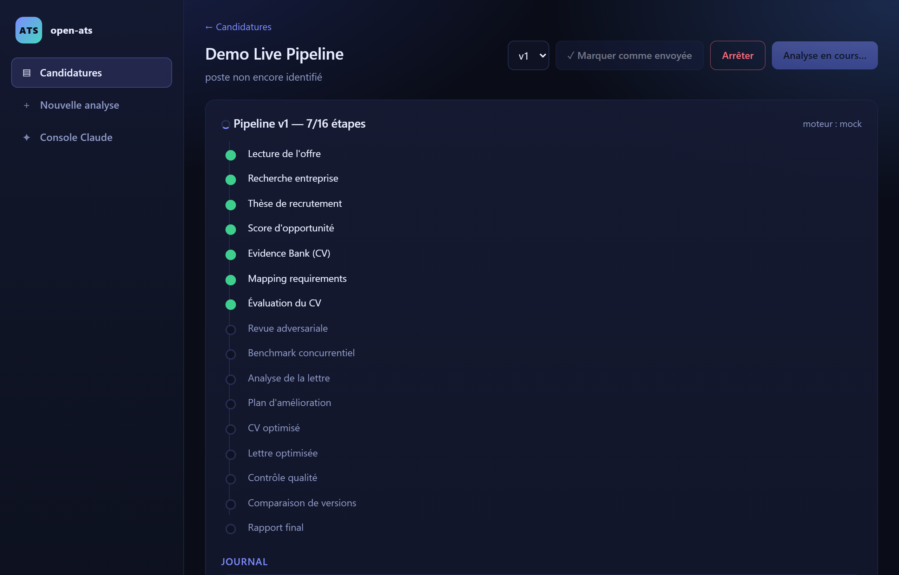
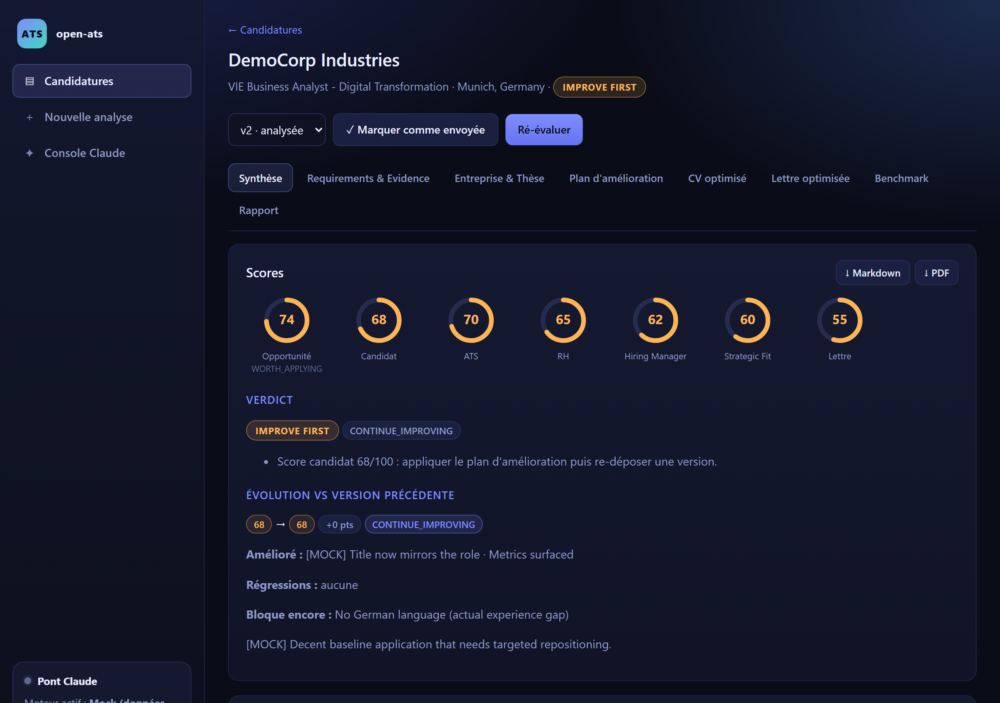
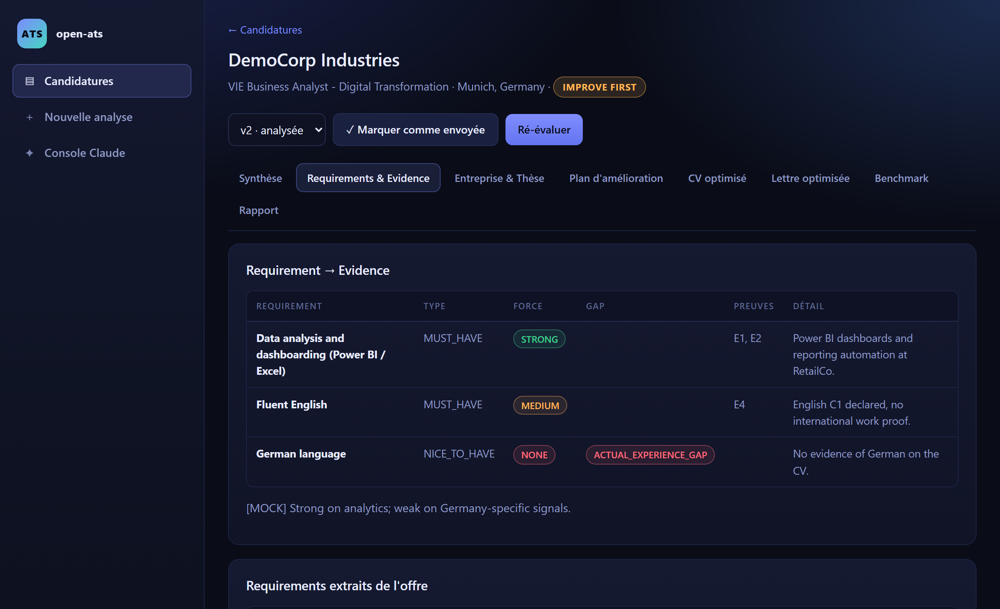
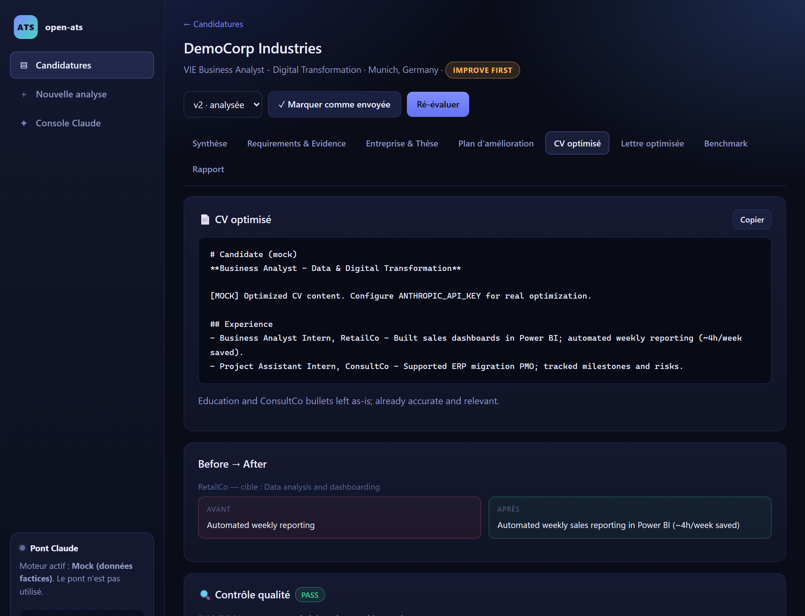
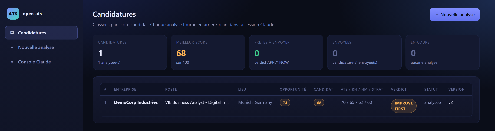
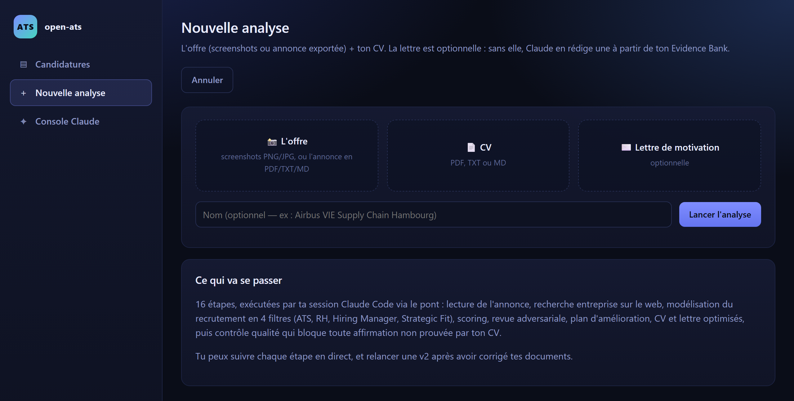
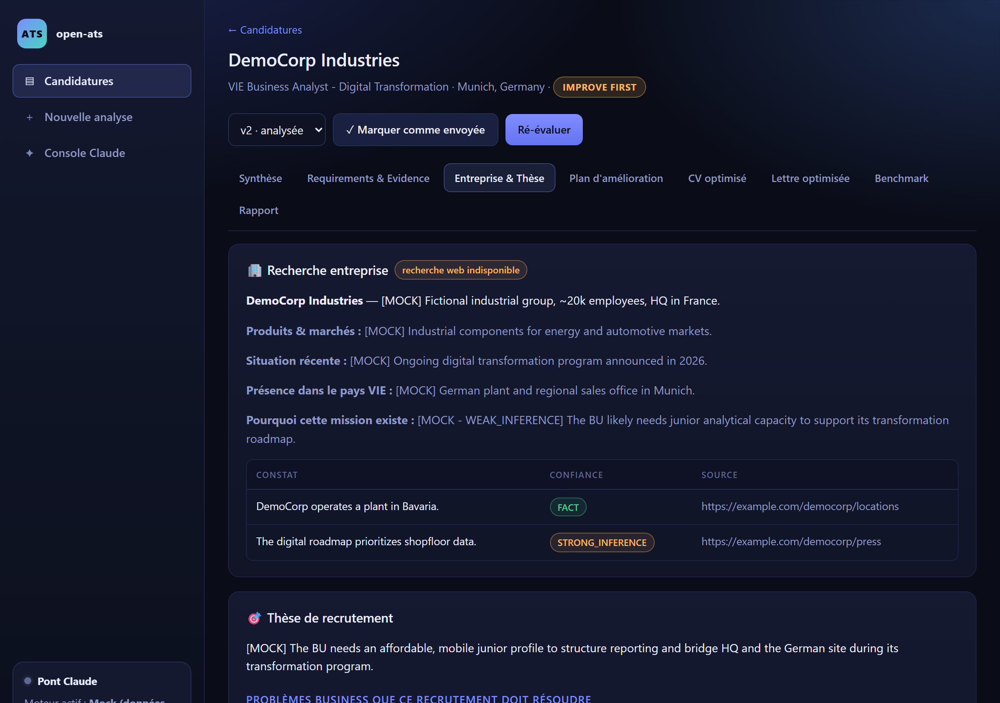
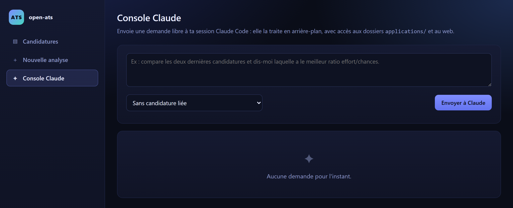

<div align="center">

# open-ats

**Un logiciel de recrutement par IA, reconstruit à la main et ouvert à tous.**
*Faites passer votre candidature par la machine, avant qu'une vraie machine ne le fasse.*

[](LICENSE)
[](https://nodejs.org)
[](#vos-données-ne-quittent-jamais-votre-machine)
[](#les-moteurs)

🇬🇧 [Read this in English](README.en.md)



</div>

---

## Pourquoi ce projet existe

On arrive tous à un moment où il faut raconter son parcours. Jeune diplômé qui se lance, professionnel qui veut réaligner sa trajectoire, ou simplement quelqu'un qui cherche les mots justes du marché d'aujourd'hui : dans tous les cas l'exercice est le même. Condenser des années de travail en une page, et faire que cette page dise en un coup d'œil qui vous êtes et où se trouve votre valeur.

C'est difficile, et ça se joue vite. Votre CV est d'abord lu par un logiciel qui le découpe, le score et le classe. Puis par une personne, en une vingtaine de secondes. Ce n'est pas injuste : un recruteur qui reçoit 800 candidatures a besoin d'un tri. Mais c'est opaque. Vous ne voyez jamais les critères, seulement le résultat. Et ça compte même quand la porte est déjà entrouverte : une cooptation ou une recommandation vous fait entrer dans la pièce, elle ne dit pas encore ce que vous valez une fois dedans.

Alors j'ai reconstruit la boîte noire, en clair, à partir de ce qu'on sait publiquement du fonctionnement des ATS et des outils de présélection par IA : le parsing de l'annonce, la matrice de critères, le scoring multi-filtres, la revue en 20 secondes, le benchmark face au vivier. Puis je me suis mis dedans.

**Voyez-le comme un tailleur.** Un bon tailleur ne vous déguise pas : il prend vos mesures, taille dans le tissu que vous avez déjà, et fait ressortir ce que vous avez de meilleur. Puis il vous dit comment ajuster la coupe selon l'endroit où vous voulez aller, et il vous dit franchement quand une pièce ne vous va pas. C'est ce que fait open-ats avec votre parcours : il mesure, il ajuste, et il vous montre ce qui vous correspond vraiment et ce qui ne vous correspond pas.

Le premier enseignement, chez moi, a été un décalage de vocabulaire et non de compétence. J'écrivais « automatisation du reporting hebdomadaire » là où le poste cherchait « analyse de données ». Même travail, mots différents, signal perdu. Voir un système me le dire noir sur blanc, critère par critère, preuve par preuve, a changé ma façon de me présenter.

Depuis, ce système m'a ouvert des portes que je n'espérais pas et m'a fait rencontrer des gens remarquables. Je le publie parce que je n'ai aucune raison de le garder pour moi : il est à vous.

---

## Ce que ça fait

Vous déposez trois choses : **l'annonce** (captures d'écran, PDF ou texte), **votre CV**, et **votre lettre** si vous en avez une. Seize étapes s'enchaînent ensuite : quatorze sont confiées à un agent, une quinzième compare vos versions dès la v2, et le rapport final est assemblé en code. Ensemble, elles vont :

1. **Comprendre le poste** : reconstruire l'annonce, en extraire une matrice de critères (`MUST_HAVE`, `STRONG_SIGNAL`, `NICE_TO_HAVE`, contexte, culture), en distinguant ce qui est écrit noir sur blanc de ce qui est simplement inféré.
2. **Comprendre l'entreprise** : recherche web, avec chaque constat étiqueté `FACT`, `STRONG_INFERENCE` ou `WEAK_INFERENCE` et sa source. Puis modéliser *pourquoi ce poste existe* et à quoi ressemble réellement le candidat attendu.
3. **Vous évaluer** : un score sur 100, décomposé en quatre filtres qui correspondent aux quatre moments où une candidature meurt : le **tri automatique (ATS)**, la **présélection RH**, le **hiring manager**, et le **fit stratégique**.
4. **Vous attaquer** : un agent adversarial cherche les raisons de vous rejeter en 20 secondes, un autre vous compare au vivier probable de candidats.
5. **Réécrire** : un plan d'amélioration classé par retour sur effort, puis un CV et une lettre réécrits.
6. **Vérifier**, et c'est le cœur du système : un contrôleur qualité relit chaque phrase réécrite et **bloque tout ce qui n'est pas prouvé par votre CV d'origine.**

Vous corrigez, vous re-déposez une v2, et le système compare : ce qui a progressé, ce qui a régressé, ce qui bloque encore. Jusqu'à ce qu'il vous dise soit *c'est prêt*, soit, et c'est tout aussi utile, *le document a atteint son plafond, l'écart restant est une vraie différence d'expérience, arrêtez de réécrire et changez de canal.*

---

## La règle qui compte

> **Le système n'a pas le droit d'inventer.**

Avant toute réécriture, un agent extrait de votre CV une **Evidence Bank** : la liste de ce que vous pouvez réellement prouver. Chaque phrase produite ensuite doit pointer vers une de ces preuves. Le contrôleur qualité bloque le reste, et quand il ne peut pas formuler quelque chose sans savoir, il laisse un marqueur explicite :

```
[À COMPLÉTER : le langage utilisé sur ce projet, je ne peux pas le déduire du CV]
```

C'est volontairement frustrant. C'est aussi le seul réglage qui rend l'outil utile : une candidature optimisée qui s'effondre à la première question d'entretien vous a fait perdre votre temps et celui du recruteur.

**Ce projet n'est pas un bourreur de mots-clés.** Il refuse d'insérer le vocabulaire d'un domaine que vous n'avez pas pratiqué, même quand ça ferait mécaniquement monter le score. Il est là pour vous aider à **dire mieux ce qui est vrai**, pas à dire autre chose.

---

## Démarrage

```bash
git clone https://github.com/spykernv/open-ats.git
cd open-ats
npm install
```

### Voir à quoi ça ressemble, en 2 minutes et sans rien consommer

Le mode `mock` remplit la pipeline avec des données factices : parfait pour visiter l'interface avant de décider si le projet vous intéresse.

```bash
# macOS, Linux
LLM_PROVIDER=mock MOCK_DELAY_MS=1200 npm start
```

```powershell
# Windows PowerShell
$env:LLM_PROVIDER="mock"; $env:MOCK_DELAY_MS="1200"; npm start
```

Puis, dans un second terminal :

```bash
npm run demo
```

Une candidature fictive complète est créée et analysée de bout en bout. Ouvrez **http://localhost:3777**.

### Pour de vrai

**Aucune clé API n'est nécessaire.** Par défaut, le moteur est **votre propre session d'agent** : l'application dépose chaque étape dans une file de fichiers, votre agent la prend, fait le travail lui-même (lire les captures d'écran et les PDF, chercher sur le web, rédiger, produire le JSON), et répond.

```bash
npm start
```

Puis, **dans votre session Claude Code** (ou dans n'importe quel agent, voir plus bas) :

```bash
npm run bridge
```

Ouvrez **http://localhost:3777**. L'encart « Pont Claude » de la barre latérale vous dit en direct si une session écoute, ce qu'elle traite, et ce qui attend dans la file. Si le pont se déconnecte, la pipeline **attend**, elle n'échoue pas. Relancez `npm run bridge` et elle repart.

---

## N'importe quel agent peut le faire tourner

**open-ats n'embarque aucun modèle et n'en entraîne aucun.** Il orchestre un agent que vous fournissez. Le programme, lui, lit des fichiers, attend, et vérifie ce qui revient.

Le pont n'est pas une intégration : c'est **un répertoire de fichiers**.

```
bridge/queue/<jobId>/
├── job.json      ← métadonnées de l'étape (titre, fichiers à lire, web search attendu ?)
├── prompt.md     ← le prompt complet
├── schema.json   ← le JSON Schema auquel la réponse doit se conformer
└── result.json   ← ce que l'agent écrit  (c'est tout)
```

Le serveur valide `result.json` contre le schéma Zod de l'étape. S'il n'est pas conforme, il republie automatiquement un job de correction contenant l'erreur exacte. Aucun secret ne transite, aucun sous-processus n'est lancé : **tout agent capable de lire et d'écrire des fichiers peut être le moteur de ce système.** `bridge/cli.mjs` (`wait` / `status` / `show` / `answer` / `fail`) n'est qu'un confort par-dessus.

---

## Comment ça marche

<p align="center">
  <picture>
    <source media="(prefers-color-scheme: dark)" srcset="docs/diagrams/pipeline-dark.svg">
    
  </picture>
</p>

<sub>Source du diagramme : [`docs/diagrams/pipeline.mmd`](docs/diagrams/pipeline.mmd) (mermaid). Les SVG sont statiques pour s'afficher partout, y compris hors de GitHub.</sub>

Le verdict final (`APPLY NOW` / `IMPROVE FIRST` / `LOW PRIORITY` / `DO NOT APPLY`) est **calculé en code**, pas par le modèle : même entrée, même sortie, toujours. Idem pour le rapport Markdown et les exports PDF : ils sont assemblés à partir des artefacts JSON, sans appel au modèle.

Les étapes partagées (offre, recherche entreprise, thèse, opportunité) ne sont calculées qu'une fois par candidature et réutilisées d'une version à l'autre.

---

## L'interface

<table>
<tr>
<td width="50%"></td>
<td width="50%"></td>
</tr>
<tr>
<td><b>Synthèse</b> : sept scores, le verdict, l'évolution depuis la version précédente, et les risques de rejet en 20 secondes.</td>
<td><b>Requirements &amp; Evidence</b> : chaque critère de l'annonce face à ce que votre CV prouve réellement, avec la distinction cruciale entre <i>défaut de positionnement</i> (réparable en réécrivant) et <i>écart d'expérience réel</i> (non réparable).</td>
</tr>
<tr>
<td></td>
<td></td>
</tr>
<tr>
<td><b>CV optimisé</b> : la réécriture, le détail avant/après puce par puce, et le contrôle d'intégrité qui a validé (ou bloqué) chaque phrase.</td>
<td><b>Tableau de bord</b> : toutes vos candidatures classées par score, avec leur verdict, leur version et leur statut d'envoi.</td>
</tr>
</table>

<details>
<summary><b>Voir les autres écrans</b> (nouvelle analyse, recherche entreprise, console)</summary>
<br>

| | |
|---|---|
|  | **Nouvelle analyse** : déposez l'annonce, le CV, la lettre. La lettre est optionnelle : sans elle, le système en rédige une depuis votre Evidence Bank. |
|  | **Entreprise & Thèse** : la recherche web, chaque constat étiqueté par niveau de confiance et sourcé, puis la modélisation du recrutement. |
|  | **Console** : une question libre à votre agent, avec accès à vos dossiers d'analyse : « compare ces deux candidatures », « relis cette puce ». |

*(Captures prises en mode démo. Les mentions `[MOCK]` sont les données factices du mode hors-ligne.)*

</details>

---

## Les moteurs

Le moteur se change **à chaud** depuis l'interface, sans redémarrer le serveur.

| Moteur | Ce que c'est | Clé API |
|---|---|:---:|
| **`claude-session`** *(défaut)* | Votre session d'agent exécute chaque étape via le pont. Vous voyez tout ce qui se passe, vous pouvez intervenir. | non |
| `claude-cli` | Sous-processus `claude -p` en headless. Même abonnement, sans supervision. Outils d'écriture désactivés par sécurité. | non |
| `anthropic` | API Anthropic directe : sorties structurées natives, streaming, thinking adaptatif. | oui |
| `mock` | Données factices, pour explorer l'interface ou développer sans rien consommer. | non |

Ajouter un moteur = **ajouter un fichier** dans `server/llm/`. Les messages de la pipeline sont agnostiques (`{type: "text" | "file"}`) ; c'est le provider qui décide comment matérialiser les fichiers.

---

## Vos données ne quittent jamais votre machine

Ce point n'est pas négociable, alors il est câblé dans le projet plutôt que promis dans une doc :

- Tout vit dans `applications/<id>/` sur **votre disque**. Aucun service tiers, aucune base de données, aucune télémétrie.
- `applications/`, `bridge/queue/`, `bridge/archive/` et `.env` sont **git-ignorés**. Vous ne pouvez pas committer votre CV par accident.
- En mode `claude-session`, le pont ne transporte que des fichiers locaux, aucun secret n'y transite.
- Les exports PDF sont rendus en local par `pdfkit`. Pas de navigateur headless, pas de service de conversion.

Ce dépôt ne contient aucune candidature réelle : le seul jeu de données est fictif et généré par `npm run demo`.

---

## Choix assumés

open-ats tourne sur votre machine, pour vous. Ce n'est pas un service multi-utilisateur, et ce n'est pas une étape qui manque : c'est la condition de la garantie ci-dessus. Voici les décisions qui en découlent, et ce qu'elles coûtent.

- **Des fichiers JSON plutôt qu'une base de données.** Une candidature est un dossier que vous pouvez ouvrir, copier, versionner et supprimer à la main. Le prix se lit dans le code : `server/storage/` écrit dans un fichier temporaire puis renomme, avec des réessais, parce que l'interface lit pendant que la pipeline écrit.
- **L'interface interroge le serveur toutes les deux secondes environ** plutôt que d'ouvrir un flux SSE. Sur des étapes qui durent des minutes, la latence ne se voit pas, et il n'y a aucun état de connexion à gérer.
- **JavaScript, avec Zod aux frontières.** La donnée non fiable, ici, ce n'est pas le code que j'écris : c'est ce que renvoie un modèle. Seule une validation à l'exécution l'attrape, et c'est le rôle des quinze schémas, un par agent. Un typage statique serait un complément utile, pas un remplacement.
- **Le verdict est testé cas par cas, le reste de bout en bout.** `npm run test:unit` fige les seuils et l'ordre de priorité du verdict ; le test E2E en mode mock couvre la pipeline entière sans rien consommer.
- **Les prompts sont calibrés pour des profils junior et VIE**, en business et en data. Sur un autre profil ou un autre marché, ils demandent un réglage, et tout est en clair dans `server/prompts/`.

---

## Aller plus loin

- **[docs/ARCHITECTURE.md](docs/ARCHITECTURE.md)** : la carte du code, le détail des 16 étapes, l'API HTTP, et comment brancher votre propre moteur ou moteur de recherche.
- `server/prompts/*.md` : **les prompts sont en clair, un fichier par agent.** C'est là que se trouve la vraie substance du projet : lisez `_core_rules.md` en premier, c'est le contrat d'intégrité que tous les agents partagent.

### Tests

```bash
npm run test:unit
```
Teste le verdict déterministe : seuils, ordre de priorité des règles, cas limites. Instantané, aucun serveur, aucune dépendance.

```bash
npm run test:bridge
```
Teste le pont seul (file de jobs, validation de schéma, réparation automatique). Aucun serveur, aucune session requise.

```bash
# macOS, Linux
LLM_PROVIDER=mock npm start
```

```powershell
# Windows PowerShell
$env:LLM_PROVIDER="mock"; npm start
```

Puis, dans un autre terminal, `npm test`. Test de bout en bout : création, pipeline 16 étapes, rapport, dépôt d'une v2, ré-évaluation, comparaison. En mode mock, ne consomme rien.

---

## Reprenez-le, cassez-le, améliorez-le

Le projet est sous licence MIT : faites-en ce que vous voulez. Quelques pistes si l'envie vous prend :

- **Adaptez les prompts à votre métier.** Ils sont calibrés pour des profils junior/VIE en business et data. Un profil senior, un poste d'ingénieur ou un marché non francophone méritent d'autres réglages, tout est dans `server/prompts/`.
- **Branchez votre agent.** Le pont est du système de fichiers : si votre agent lit et écrit des fichiers, il peut être le moteur.
- **Ajoutez un filtre.** Le modèle à quatre filtres reflète ma compréhension du processus de recrutement. La vôtre est peut-être meilleure.

Les issues et les PR sont bienvenues, et les retours d'expérience encore plus, surtout si vous l'avez utilisé pour de vrai. Si une partie du code n'est pas claire, c'est un défaut de ma part : ouvrez une issue, je corrigerai.

---

## Si vous voulez en faire un produit

Ce qui est publié ici est un outil local, et il le restera. Les deux prolongements évidents, eux, ne sont pas dans ce dépôt :

- **Côté candidat**, un service en ligne où l'on dépose son CV sans rien installer.
- **Côté entreprise**, un outil d'aide à la décision pour les équipes RH, qui applique la même exigence de preuve à la lecture des candidatures reçues.

J'ai documenté les prochaines étapes produit et le modèle d'affaires des deux, et une roadmap d'implémentation en entreprise est déjà en cours avec des professionnels RH qui veulent la pousser. Le code est sous licence MIT, vous n'avez besoin de la permission de personne ; mais si c'est un sujet sur lequel vous voulez avancer sérieusement, écrivez-moi sur [LinkedIn](https://www.linkedin.com/in/jonathannaal/) plutôt que de repartir de zéro.

---

## Un mot sur l'exercice lui-même

Écrire son CV et faire la synthèse de son parcours, c'est un travail sous-valorisé, parfois bâclé, expédié un dimanche soir entre deux candidatures. Je crois au contraire que c'est un des plus importants qu'on fasse pour sa carrière.

Prendre le temps d'une vraie rétrospective. Se poser, et regarder où étaient réellement ses forces. Regarder ce que son CV dit de soi, puis le comparer à ce que les gens qui ont travaillé avec vous disent de vous : l'écart entre les deux est souvent ce que l'exercice a de plus instructif. C'est ce qui permet de mieux s'aligner avec ce qu'on veut faire, d'explorer les nouvelles tendances du marché, et de se repositionner.

Pour moi, ça a été un excellent complément à l'écriture de ma thèse sur un système de management d'agents IA pour piloter un produit numérique. Les deux travaux se sont nourris l'un l'autre. Et c'est ce qui a marqué les esprits des personnes avec qui j'ai échangé : pas le document en lui-même, mais la clarté que l'exercice m'avait donnée sur le marché, sur les endroits où j'apporterais le plus de valeur, et sur ce qui m'excite intellectuellement.

C'est ça que je vous souhaite d'y trouver. Le CV optimisé n'est que le sous-produit.

Si le sujet vous intéresse, ma thèse est en cours de modération sur HAL et sera disponible ici : <https://hal.science/view/index/docid/5735731>

---

<div align="center">

**Jonathan Naal**

Pour plus d'informations sur mon parcours ou des opportunités de collaboration, voici mon [LinkedIn](https://www.linkedin.com/in/jonathannaal/).

<sub>MIT · Ce projet n'est affilié à aucun éditeur d'ATS ni à aucun fournisseur de modèles.</sub>

</div>
